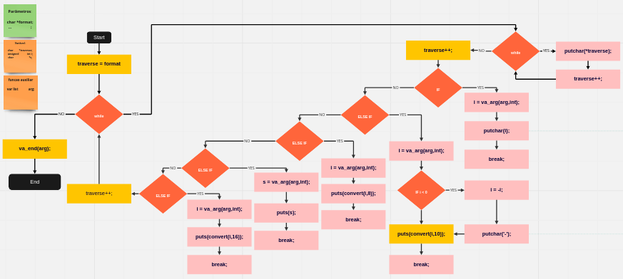

#ft_Printf42

ft_printf42 é um projeto para recodificar o printf em C da libc. Ele irá gerenciar as seguintes conversões: cspdiuxX% !
Gerenciar qualquer combinação dos seguintes sinalizadores: '-0.' e largura mínima do campocom todas as conversões.
Gerenciar todos os seguintes sinalizadores: '# +' (sim, um deles é um espaço).
Entregando os arquivos: * .c, * / *. c, * .h, * / *. h, Makefile.

ft_printf42 is a project to recode printf in C from libc.  It will manage the following conversions: cspdiuxX% !  Handle any combination of the following flags: '-0.'  and minimum field width with all conversions.  Manage all of the following flags: '#+' (yes, one of them is a space).  Delivering the files: * .c, * / *.  c, * .h, * / *.  h, Makefile. <br/>

## Badge


## SKills

 - Rigor
 - Algorithms & AI

 ## My grade

  

 ## Flowchat

 

## Use:

🚧 project:
```
ft_printf42 $ make bonus
```
Compile your main with the library:
```
clang main.c libftprintf.a
```
:shower: Clean Obj files:<br/>
```
$ make clean
```
:shower: :shower: Clean All (obj files + binary):<br/>
```
$ make fclean
```
:shower: :shower: 🚧 Clean All + build:<br/>
```
$ make re
```
<br/>See Makefile<br/>

### Made with: <br/>
### Jorge Alves
<div style="display: inline_block">
 <a href="https://github.com/jorgeedualves/jorgeedualves" target="_blank"></a>
 <a href="https://www.linkedin.com/in/jorge-eduardo-alves-094b4331/" target="_blank"></a> 
</div>

### Alfredo Neto
<div style="display: inline_block">
 <a href="https://github.com/Alfredo-Neto" target="_blank"></a>
 <a href="https://www.linkedin.com/in/alfredo-neto-a2515814b/" target="_blank"></a> 
</div>

### Alexandre Zamarion
<div style="display: inline_block">
 <a href="https://github.com/alezamarion" target="_blank"></a>
 <a href="https://www.linkedin.com/in/alexandre-zamarion-cepeda-a3766323a/" target="_blank"></a> 
</div>

